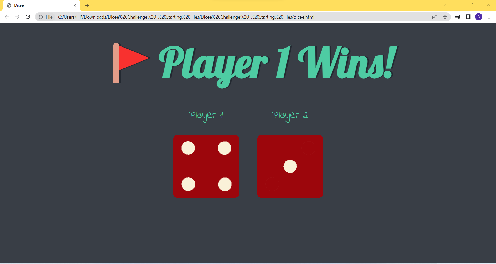
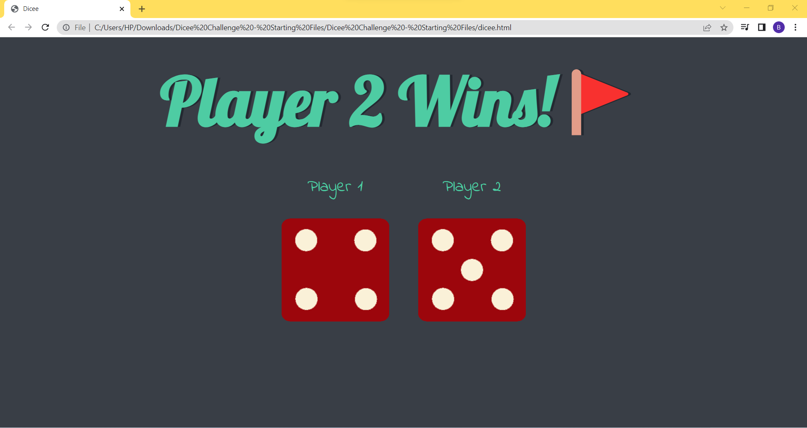
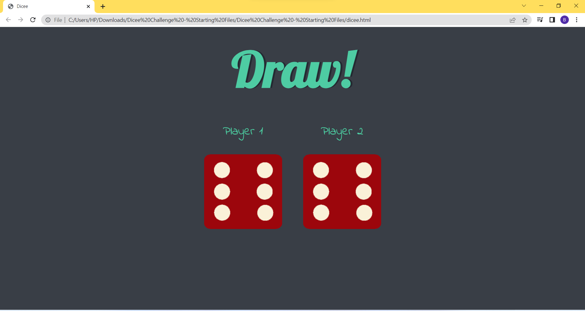

# Dice-Game
This is the 1st Boss Level Challenge Project for The Complete Web Development Bootcamp Course by Angela Yu.
The website simulates a dice game challenge where on every refresh both dice are thrown and a random dice face is generated for both players. The player with larger Dice wins!

## Snapshots:
### Player 1 Wins-

### Player 2 Wins-

### Draw Condition-

## Inspiration:
The inspiration for the websites have been taken from the follwing:
* [Angela Yu](https://github.com/angelabauer)'s Dice Challange int the Udemy Complete Web Development Bootcamp Course.

## Acknowledgements:
I'd like to express my greatest gratitude towards [angelabauer](https://github.com/angelabauer) for her course at [udemy](https://www.udemy.com/course/the-complete-web-development-bootcamp/).
